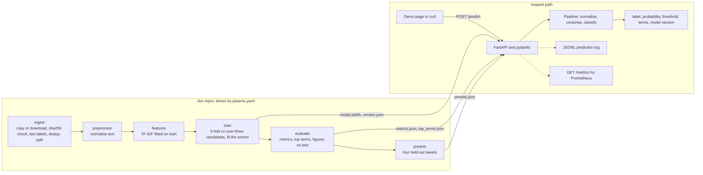

# tweet-emotion-pipeline

[](https://github.com/Zulqarnain-10/tweet-emotion-pipeline/actions/workflows/ci.yml)
[](https://github.com/Zulqarnain-10/tweet-emotion-pipeline/actions/workflows/cd.yml)
[](LICENSE)
[](https://syedzulqarnainh-tweet-emotion-pipeline.hf.space)

A tweet emotion classifier shipped like a product: hashed data, six DVC stages driven by one
`params.yaml`, cross-validated model selection, a tested API, CI/CD, and a live endpoint.

A notebook proves that a model can be trained once. This repository proves the rest. The source
CSV ships in the repository and is checked by hash before anything runs, every step is a DVC stage with declared inputs and outputs, three
candidate models are compared by cross-validation on the training split, the winner sits behind a
FastAPI endpoint with tests, the container builds and deploys from GitHub Actions, and a CI job
rebuilds the whole pipeline from scratch to check the numbers printed in this file.

Demonstration system trained on public tweets labelled happiness or sadness by crowd workers in
2016. It scores short English text only and is not a mental-health tool. The same sentence
travels with every prediction the API returns.

## Live demo and one-command run

Live endpoint: [https://syedzulqarnainh-tweet-emotion-pipeline.hf.space](https://syedzulqarnainh-tweet-emotion-pipeline.hf.space),
a Hugging Face Space built from this repository's Dockerfile. If the Space is asleep it takes a
few seconds to wake. A Render free service (`render.yaml`) is the documented fallback host.

Run the same service on your machine with one command:

```
docker run -p 8000:8000 ghcr.io/zulqarnain-10/tweet-emotion-pipeline:latest
```

Then open http://127.0.0.1:8000 for the demo page, /docs for the OpenAPI schema, /version for the
receipts as JSON, /terms for the words that move the score, and /metrics for Prometheus. The image
is published by the Deploy workflow on every green push to main.

## The problem

Given one short tweet, say whether it expresses happiness or sadness and how sure the model is.
The data is the CrowdFlower "Sentiment Analysis: Emotion in Text" set from 2016: 40,000 tweets,
each with one of 13 crowd-assigned emotion labels. The binary task keeps the 5,209 tweets labelled
happiness and the 5,165 labelled sadness, drops duplicate texts (judged after HTML unescaping,
case folding, and whitespace collapsing) before the split so nothing leaks from train to test,
and holds out a stratified 20 percent with seed 42. Source, hash, label
counts, and quirks are in [data/DATA_CARD.md](data/DATA_CARD.md).

## Approach

The pipeline is six DVC stages driven by `params.yaml`. The shipped model is one scikit-learn
`Pipeline`: a picklable `TextNormalizer` (lower-case; strip URLs, mentions, HTML entities,
numbers, and punctuation; drop the stop words, which are the NLTK English list of 198 words
frozen in `configs/stopwords_en.txt` minus the negation tokens listed in `params.yaml`
`preprocess.keep_words`, 174 in effect, because NLTK's list contains "not" and dropping it would
score "not happy" like "happy"; WordNet lemmas), a TF-IDF vectoriser fitted on the training split only (1-2 grams, at most 5,000
features, `min_df` 2, sublinear tf), and a classifier. Three candidates, logistic regression,
multinomial naive Bayes, and XGBoost, are compared by 5-fold stratified cross-validation on the
training split, and the highest mean cv ROC-AUC ships. The decision threshold is 0.5. The test
split is scored once, in `evaluate`, which also asserts that raw text through the full pipeline
gives the same probabilities as the pre-vectorised matrix, so what is measured is what is served.



## Results

The block below is written by `python -m tweet_emotion.sync_readme` from the report files, and
`python -m tweet_emotion.sync_readme --check` fails whenever the two disagree. Nothing in it is
typed by hand; until the pipeline has run once, every field reads `[todo]`.

<!-- metrics:start -->
<!-- Generated by python -m tweet_emotion.sync_readme from reports/*.json and models/version.json. Edit those files, not this block. -->
Held-out test split, n = 2,068, share labelled happiness 0.5015, decision threshold 0.50. Nothing below was tuned on it.

| Metric | Logistic regression (this model) | Majority baseline |
|---|---|---|
| Accuracy | 0.8129 | 0.5015 |
| Precision | 0.8113 | |
| Recall | 0.8168 | |
| F1 | 0.8140 | |
| ROC-AUC | 0.8890 | |
| PR-AUC (average precision) | 0.8909 | |
| Brier score (lower is better) | 0.1410 | |
| Log loss (lower is better) | 0.4431 | |

The majority baseline predicts the more common class for every tweet, so only its accuracy is meaningful.

Candidates, 5-fold stratified cross-validation on the training split only, selected by cv ROC-AUC (models/version.json):

| Candidate | cv ROC-AUC (mean ± std) | cv accuracy | Fit seconds | Shipped |
|---|---|---|---|---|
| Logistic regression (`logreg`) | 0.8868 ± 0.0047 | 0.8037 | 0.05 | yes |
| Multinomial naive Bayes (`nb`) | 0.8685 ± 0.0040 | 0.7820 | 0.01 | |
| XGBoost (`xgboost`) | 0.8704 ± 0.0069 | 0.7876 | 19.90 | |

Latency: p95 140.60 ms for POST /predict, 300 requests at concurrency 10, 105.71 requests per second, on local uvicorn, Windows 11, Python 3.12, single process (reports/loadtest.json).

Provenance: trained 2026-09-08T21:53:52Z, git 5d310c0, data sha256 cbceef785468, rows 8,269 train / 2,068 test (models/version.json).
<!-- metrics:end -->

Figures: [ROC](reports/figures/roc.png), [precision-recall](reports/figures/pr.png),
[confusion matrix](reports/figures/confusion.png), [top terms](reports/figures/top_terms.png).
The full metric set, the confusion matrix, and the top terms are copied into
[models/MODEL_CARD.md](models/MODEL_CARD.md) after each retrain.

## Receipts

Every public number has a file and a command behind it. [docs/PROOF.md](docs/PROOF.md) maps each
one individually; this table is the short version.

| Numbers | File | Produced by |
|---|---|---|
| Accuracy, precision, recall, F1, ROC-AUC, PR-AUC, Brier, log loss, confusion matrix, majority baseline, cv results per candidate | [reports/metrics.json](reports/metrics.json) | `python -m tweet_emotion.evaluate` (stage `evaluate`) |
| Words that move the score, on the demo page and in the model card | [reports/top_terms.json](reports/top_terms.json) | `python -m tweet_emotion.evaluate` (stage `evaluate`) |
| ROC, precision-recall, confusion, and top-term figures | [reports/figures/](reports/figures/) | `python -m tweet_emotion.evaluate` (stage `evaluate`) |
| Latency percentiles, throughput, error rate | [reports/loadtest.json](reports/loadtest.json) | `python -m tweet_emotion.loadtest --url http://127.0.0.1:8000 --requests 300 --concurrency 10 --host "..."` |
| Shipped candidate, git sha, data hash, cv record, winner hyperparameters, library versions | [models/version.json](models/version.json) | `python -m tweet_emotion.train` (stage `train`) |
| The four demo tweets and their scores | [configs/presets.json](configs/presets.json) | `python -m tweet_emotion.presets` (stage `presets`) |
| Vocabulary size, matrix density, rows per split | `data/features/feature_manifest.json` (rebuilt by `dvc repro`, not committed) | `python -m tweet_emotion.features` (stage `features`) |
| Where the CSV came from (`fetched_from`), rows read, label counts, duplicate texts in the full file and dropped from the kept rows, rows and positive rate per split | `data/raw/fetch_manifest.json` (rebuilt by `dvc repro`, not committed; copied into the [data card](data/DATA_CARD.md)) | `python -m tweet_emotion.ingest` (stage `ingest`) |

CI run that reproduced these numbers: [Actions, run 34285294694](https://github.com/Zulqarnain-10/tweet-emotion-pipeline/actions/runs/34285294694).

## Stack

Python 3.12, pandas, scikit-learn (`TfidfVectorizer`, `LogisticRegression`, `MultinomialNB`),
xgboost-cpu for the third candidate, NLTK WordNet for lemmas, DVC for the pipeline, FastAPI with
pydantic v2 and uvicorn for serving, prometheus-fastapi-instrumentator for `/metrics`, pytest and
ruff, pre-commit with gitleaks, a multi-stage non-root Docker image on `python:3.12-slim`, GitHub
Actions for CI and CD, GHCR for the image, a Hugging Face Space for the live endpoint. Exact
serving versions are pinned in [requirements.txt](requirements.txt); pipeline and dev extras in
the two files next to it.

## Run it locally

Six commands in PowerShell:

```powershell
python -m venv .venv; .\.venv\Scripts\Activate.ps1
python -m pip install -r requirements-dev.txt -e .
python -m tweet_emotion.setup_nltk
python -m dvc repro
python -m dvc dag; python -m dvc metrics show
python -m tweet_emotion.api
```

The same six in bash:

```bash
python -m venv .venv && source .venv/bin/activate
python -m pip install -r requirements-dev.txt -e .
python -m tweet_emotion.setup_nltk
python -m dvc repro
python -m dvc dag && python -m dvc metrics show
python -m tweet_emotion.api
```

`setup_nltk` fetches the WordNet corpus once (it honours `NLTK_DATA`). `dvc repro` copies the CSV
committed at `data/source/tweet_emotions.csv` into `data/raw` when its sha256 matches
`params.yaml`, downloads it from `data.url` only when that copy is missing, verifies the hash
either way, and runs the six stages end to end, so a fresh clone rebuilds without network access;
the stage commands call plain `python`, so keep the venv activated. The API then serves
http://127.0.0.1:8000. If PowerShell refuses to run `Activate.ps1`, run
`Set-ExecutionPolicy -Scope Process RemoteSigned` first; it applies to that window only. Keep the
clone path short (for example `C:\src\tweet-emotion-pipeline`) or enable Windows long paths before
`dvc repro`, because DVC's run cache nests deep paths.

Useful extras:

```powershell
python -m pytest                                   # tests with coverage
python -m ruff check .; python -m ruff format --check .
python -m tweet_emotion.loadtest --url http://127.0.0.1:8000 --requests 300 --concurrency 10 --host "local uvicorn, Windows 11, Python 3.12, single process"
python -m tweet_emotion.sync_readme                # refresh the Results block from the reports
docker compose up                                  # the API from the local Dockerfile
```

Every one of those also has a `make` target (`make PYTHON=.venv/Scripts/python.exe <target>` on
Windows without an activated venv):

| Target | Runs |
|---|---|
| `setup` | `pip install -r requirements-dev.txt -e .` |
| `nltk` | `python -m tweet_emotion.setup_nltk` |
| `repro` | `dvc repro` |
| `dag` | `dvc dag` |
| `metrics` | `dvc metrics show` |
| `test` | `pytest` with coverage |
| `lint` | `ruff check` and `ruff format --check` |
| `format` | `ruff format` and `ruff check --fix` |
| `serve` | `python -m tweet_emotion.api` |
| `loadtest` | the load-test command above against `API_URL` |
| `docker-build` | build the image from the local Dockerfile |
| `docker-run` | run that image on port 8000 |
| `sync-readme` | `python -m tweet_emotion.sync_readme` |
| `social-preview` | `scripts/make_social_preview.py`, the card GitHub shows when the repo is linked |
| `space-dry-run` | `scripts/deploy_space.py --dry-run`, stage the Space folder without uploading |
| `clean` | remove caches, coverage output, and build folders |

## What DVC tracks

`dvc.yaml` declares, for each of the six stages, the command, its `deps` (source files and the
data files it reads), the `params.yaml` block it reads, and its `outs`. `evaluate` declares
`reports/metrics.json` as a `metrics` file, which is what `dvc metrics show` and
`dvc metrics diff` read. After a run, `dvc.lock` records the md5 of every dependency, parameter,
and output. `dvc repro` compares the workspace against that lock and reruns only the stages whose
inputs changed, plus everything downstream of them; an unchanged stage is skipped in a fraction of
a second.

The source CSV is committed at `data/source/tweet_emotions.csv`, kept byte-identical by a
`.gitattributes` `-text` rule, and declared as a dependency of `ingest`. Data outputs (`data/raw`,
`data/processed`, `data/features`) live in the local DVC cache and are gitignored. Model and report
outputs (`models/`, `reports/`, `configs/presets.json`) are declared `cache: false` and committed,
so a clone serves the API without rebuilding anything. There is no DVC remote: `ingest` starts
from the committed file, is deterministic, and is hash-checked, so a clean clone rebuilds every
data file with `dvc repro` and no network.

The experiment that shows it working. Open `params.yaml` and change `features.max_features` from
5000 to any other value, then:

```
python -m dvc repro
```

`ingest` and `preprocess` are skipped: their dependencies and their parameter blocks did not
change. `features` reruns because it reads the `features` block; `train` reruns because it
depends on `data/features/train.npz` and `models/vectorizer.joblib`, which `features` just
rewrote; `evaluate` reruns because it depends on `models/model.joblib`; `presets` reruns because
it depends on the model too. Four stages, in that order, and not the two before them.

```
python -m dvc params diff      # the old and new max_features, against the last commit
python -m dvc metrics diff     # every metric in reports/metrics.json that moved
python -m dvc dag              # the stage graph, in text
```

To go back, restore the committed files and let DVC restore the cached data outputs to match:

```
git checkout -- params.yaml dvc.lock models reports configs/presets.json
python -m dvc checkout
```

Retraining for real is the same loop: change `params.yaml`, run `dvc repro`, run
`python -m tweet_emotion.sync_readme` to refresh the Results block, and commit the model, the
reports, `dvc.lock`, and this file together. CI's reproduce job then rebuilds the pipeline from
the committed CSV and fails if any metric differs from the committed report beyond the 0.005
tolerance (absolute for values at or below 1, relative above it; the exact rule, including the
allowance for the four confusion counts, is in [docs/ARCHITECTURE.md](docs/ARCHITECTURE.md)).

## Run it yourself

Any short English text works. The demo page fills its own curl block with the first held-out
tweet from [configs/presets.json](configs/presets.json); this one is just an example.

```bash
curl -X POST http://127.0.0.1:8000/predict -H "Content-Type: application/json" -d '{
  "text": "finally home after a long week and so happy to see everyone"
}'
```

In PowerShell, where `curl` is an alias, use `curl.exe` or:

```powershell
$body = '{"text": "finally home after a long week and so happy to see everyone"}'
Invoke-RestMethod -Method Post -Uri http://127.0.0.1:8000/predict -ContentType "application/json" -Body $body
```

The response carries `label` (`happiness` or `sadness`), `probability_happiness`, `probability`
of the returned label, the `threshold`, the `normalized_text` the model actually saw, `terms`
(the tokens that moved the score, when the shipped classifier is linear), the model name and
version, and the disclaimer. `POST /predict/batch` takes `{"items": [...]}` with 1 to 100 texts.
Whitespace-only text, or text over 1,000 characters, returns a 422 with FastAPI's standard detail
list; a body over 1,250,000 bytes (1.25 MB, which covers a full batch of 100 texts of 1,000
JSON-escaped characters) returns 413.

`GET /metrics` exposes request counts, a latency histogram, and error counts from
prometheus-fastapi-instrumentator, plus `tweet_emotion_predictions_total{label=...}`. Every
prediction is appended as one JSON line to `PREDICTION_LOG_PATH` (default: a file in the system
temp directory) with the timestamp, label, probability, character count, and model version, never
the text itself. On a free host that file is ephemeral; treat it as a demonstration of the
mechanism, not as storage.

## Limitations and next steps

- English tweets from 2016 with crowd-assigned labels. Nothing here transfers to another
  platform, language, or year without re-estimation. It is a demonstration system, not a
  mental-health tool.
- Binary by construction. Thirteen labels are collapsed to two, so a tweet that is neutral,
  worried, or angry is still forced into happiness or sadness; the probability says how far the
  text leans, not whether either label fits.
- Bag of n-grams. The model sees words and adjacent pairs, so word order beyond bigrams,
  sarcasm, and negation that reaches further than one token are invisible to it.
- The split is random and stratified, not time-based, so the metrics say nothing about decay as
  language changes.
- Latency is one measurement, not a benchmark. The receipt `reports/loadtest.json` names the
  host it was measured on; a run against the Space includes network time from the client.
- Next steps: a DVC remote so the data cache travels with the repository, the full 13-label task
  under the same cross-validation protocol, and a small fine-tuned transformer as a fourth
  candidate compared on the same folds.

## About

Syed Zulqarnain Hassan, Data Scientist and AI/ML Engineer. Data scientist with a shipping record.
This repository is one of the receipts;
[credit-risk-service](https://github.com/Zulqarnain-10/credit-risk-service) is another.

[zulqarnainhassan.com](https://zulqarnainhassan.com) ·
[GitHub](https://github.com/Zulqarnain-10) ·
[LinkedIn](https://www.linkedin.com/in/syedzulqarnainh)

Code is MIT licensed ([LICENSE](LICENSE)). The CrowdFlower CSV is redistributed unchanged at
`data/source/tweet_emotions.csv` so that a clone reproduces the pipeline; the original terms are
[todo: confirm the CrowdFlower Data for Everyone terms before any reuse beyond this pipeline], no
license is asserted for the data here, and the file will be removed on request. The
[data card](data/DATA_CARD.md) carries the source and the hashes.
