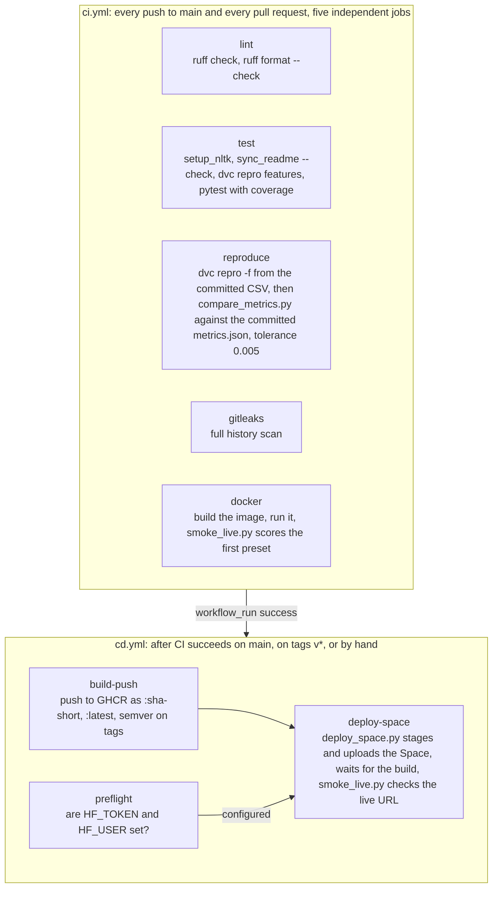

# Architecture

How `tweet-emotion-pipeline` is put together: the components, the path a request takes, the
path the data takes through the six DVC stages, what is versioned where, what is thrown away,
how the two GitHub workflows fit, and the protocol that keeps every public number honest.
Numbers on this page come from the report files named next to them.

## Layout

```
tweet-emotion-pipeline/
  params.yaml  dvc.yaml  dvc.lock          the pipeline: settings, stage graph, recorded hashes
  src/tweet_emotion/
    settings.py                            paths, column and label contracts, the disclaimer
    ingest.py  preprocess.py  features.py  one module per stage, each runnable as
    train.py  evaluate.py  presets.py      python -m tweet_emotion.<module>
    setup_nltk.py                          fetch the WordNet corpus once
    loadtest.py  sync_readme.py            the latency receipt; the README block
    api/                                   FastAPI app, schemas, model loader, demo page
  configs/   stopwords_en.txt  logging.yaml  presets.json (generated)
  data/      DATA_CARD.md  source/tweet_emotions.csv (the CSV, committed unchanged)
             raw/ processed/ features/ (generated, gitignored, DVC cache)
  models/    MODEL_CARD.md  model.joblib  vectorizer.joblib  version.json (generated, committed)
  reports/   metrics.json  top_terms.json  loadtest.json  figures/ (generated, committed)
  docs/      ARCHITECTURE.md  PROOF.md  social-preview.png
  scripts/   compare_metrics.py  smoke_live.py  deploy_space.py  make_social_preview.py
  tests/     pytest suite
  Dockerfile  docker-compose.yml  Makefile  render.yaml  .github/workflows/{ci,cd}.yml
```

## Components

| Component | Where | Role |
|---|---|---|
| Parameters | `params.yaml` | Single source of every stage setting: data URL, the committed copy's path, and hash, kept labels, split seed, normaliser switches, vectoriser settings, candidate hyperparameters, threshold, API limits. |
| Settings | `src/tweet_emotion/settings.py` | Paths (resolved from `TWEET_EMOTION_HOME` or the folder holding `params.yaml`), CSV column names, the label order, the `.npz` key names, the disclaimer, `PORT` and `LOG_LEVEL` parsing. No secrets. |
| Pipeline stages | `src/tweet_emotion/{ingest,preprocess,features,train,evaluate,presets}.py` | One module per DVC stage, pure functions plus `main()`, deterministic given `params.yaml`. |
| Text normaliser | `src/tweet_emotion/preprocess.py` | `TextNormalizer`, a picklable sklearn transformer. The only place text normalisation lives; the first step of the shipped `Pipeline`. |
| Model artifacts | `models/model.joblib`, `models/vectorizer.joblib`, `models/version.json` | The full text-to-probability pipeline, the fitted vectoriser on its own, and the provenance record. |
| Reports | `reports/metrics.json`, `reports/top_terms.json`, `reports/loadtest.json`, `reports/figures/*.png` | Every public number. |
| API | `src/tweet_emotion/api/` | FastAPI app, pydantic v2 schemas, model loader, uvicorn entry point, demo page. |
| Demo page | `src/tweet_emotion/api/static/{index.html,style.css,app.js}` | One page, vanilla JS, reads `/version`, `/presets`, `/terms` and posts to `/predict`; every number renders `[todo]` until it arrives. |
| Load test | `src/tweet_emotion/loadtest.py` | N requests at concurrency C against `POST /predict`, percentiles to `reports/loadtest.json`. |
| Sync | `src/tweet_emotion/sync_readme.py` | Renders the Results block in `README.md` from the reports; `--check` fails when they disagree. |
| Container | `Dockerfile`, `docker-compose.yml` | Multi-stage build on `python:3.12-slim`, non-root user `app`, WordNet baked in at `/opt/nltk_data`, `HEALTHCHECK` on `/health`. |
| Workflows | `.github/workflows/ci.yml`, `cd.yml` | Lint, test, reproduce, secrets scan, image build; publish and deploy. |
| Scripts | `scripts/compare_metrics.py`, `smoke_live.py`, `deploy_space.py`, `make_social_preview.py` | Compare two `metrics.json` files, smoke-test a live URL, stage and push the Space, draw the social card. |

## Request path

1. The browser loads `GET /`, which returns `static/index.html`. The page fetches `/version`
   (provenance, headline metrics, the load-test block when present, the disclaimer), `/presets`
   (four real held-out tweets chosen by the model's own scores), and `/terms` (the words that
   move the score). Anything the API cannot supply renders as a `[todo]` chip; the page never
   hard-codes a number.
2. The form posts `{"text": ...}` to `POST /predict`. Pydantic rejects empty or whitespace-only
   text and text longer than `params.yaml` `api.max_chars` (1,000) with a 422. A middleware
   rejects bodies over 1,250,000 bytes (1.25 MB, which covers a full batch of 100 texts of 1,000
   JSON-escaped characters) with a 413. `POST /predict/batch` accepts 1 to `api.batch_max` (100)
   items.
3. `ModelBundle.predict_texts` runs the sklearn `Pipeline` loaded from `models/model.joblib`:
   `TextNormalizer` produces the normalised string, the fitted `TfidfVectorizer` produces the
   sparse row, the classifier returns the probability of happiness.
4. The label compares that probability with `threshold` read once from `reports/metrics.json`
   at startup. The response carries `label`, `probability_happiness`, `probability` of the
   returned label, `threshold`, `normalized_text`, `terms` (the up-to-eight tokens in the
   request with their `coef * value` contributions, when the classifier is linear, otherwise
   null), model name, model version, and the disclaimer.
5. Side effects: the `tweet_emotion_predictions_total{label}` counter increments; one JSON line
   with timestamp, label, probability, character count, and model version is appended to
   `PREDICTION_LOG_PATH`. The text itself is never logged. A failed log write is a warning,
   never an error for the caller.
6. Logging is structured JSON from `configs/logging.yaml`. `GET /metrics` is exposed by
   prometheus-fastapi-instrumentator with request count, latency histogram, and error count per
   handler.

The model, `version.json`, `metrics.json`, `presets.json`, and `top_terms.json` load once in the
FastAPI lifespan handler. `loadtest.json` is optional and shows up on `/version` when present.

## Data flow through the DVC stages

| Stage | Reads | Writes | Notes |
|---|---|---|---|
| `ingest` | `params.data`, `data/source/tweet_emotions.csv` | `data/raw/tweet_emotions.csv`, `train.csv`, `test.csv`, `fetch_manifest.json` | Copies the committed CSV into `data/raw` when its sha256 matches `params.yaml`, downloads from `data.url` only when that copy is missing, verifies sha256 either way and records `fetched_from` in the manifest; keeps the two labels; drops duplicate texts (judged after HTML unescaping, case folding, and whitespace collapsing, first occurrence kept) and empty texts; splits 80 / 20 stratified with seed 42; sorts by `tweet_id`. |
| `preprocess` | `params.preprocess`, `configs/stopwords_en.txt`, raw split CSVs | `data/processed/train.csv`, `test.csv` | Applies `TextNormalizer` to `text`; same three columns; logs the share of rows that became empty. |
| `features` | `params.features`, processed CSVs | `data/features/train.npz`, `test.npz`, `feature_manifest.json`, `models/vectorizer.joblib` | Fits the vectoriser on train only, transforms both splits, saves CSR matrices with the label vector. |
| `train` | `params.train`, `params.preprocess`, `train.npz`, the vectoriser | `models/model.joblib`, `models/version.json` | 5-fold stratified cv over the candidates, fits the winner on all of train, wraps normaliser, vectoriser, and classifier into one `Pipeline` without refitting, verifies `predict_proba` on a sample string. |
| `evaluate` | `params.evaluate`, the model, `version.json`, `test.npz`, `data/raw/test.csv` | `reports/metrics.json` (DVC metrics file), `reports/top_terms.json`, `reports/figures/` | Scores the test split once; asserts raw-text and pre-vectorised paths agree to 1e-6; writes metrics, confusion, majority baseline, the cv record, top terms, four figures. |
| `presets` | `params.presets`, the model, `metrics.json`, `data/raw/test.csv` | `configs/presets.json` | Scores every held-out tweet and picks the clearest happiness, the clearest sadness, the closest call, and the most confident miss, preferring short texts without mentions or links. |

`dvc repro` reruns a stage only when one of its `deps` or its `params` block changed, and then
everything downstream. Changing `features.max_features` reruns `features`, `train`, `evaluate`,
and `presets`; `ingest` and `preprocess` are skipped. `dvc dag` prints the graph; `dvc metrics
show` and `dvc metrics diff` read `reports/metrics.json`; `dvc params diff` reads `params.yaml`.

## What is versioned where

| Artifact | git | DVC cache | Docker image | Space |
|---|---|---|---|---|
| Source, tests, workflows, `params.yaml`, `dvc.yaml`, `dvc.lock`, `configs/stopwords_en.txt` | yes | | package and configs only | package and configs only |
| `data/source/tweet_emotions.csv`, the source CSV | yes (committed unchanged; `-text` in `.gitattributes`; an `ingest` dep) | | | |
| The copy of the CSV under `data/raw`, split CSVs, processed CSVs, `.npz` matrices, both manifests | no (gitignored) | yes, local `.dvc/cache`, no remote | | |
| `models/model.joblib`, `vectorizer.joblib`, `version.json` | yes (`cache: false` outs) | | yes | yes |
| `reports/metrics.json`, `top_terms.json`, `figures/` | yes (`cache: false` outs) | | `metrics.json`, `top_terms.json`, `loadtest.json` if present | same as image |
| `reports/loadtest.json` | yes (written by the load test, not by a stage) | | if present | if present |
| `configs/presets.json`, `configs/logging.yaml` | yes | | yes | yes |
| WordNet corpus | never | | `/opt/nltk_data`, fetched in the builder stage | same as image |
| Container image | | | GHCR `:sha-<short>`, `:latest`, semver tags on `v*` | built again by the Space from the staged Dockerfile |
| Space README with Hugging Face front matter | never | | | written by `deploy_space.py` into `.space_build/` |

There is no DVC remote. The source CSV is in git, and `ingest` is deterministic and
hash-checked, so a clean clone rebuilds every DVC output with `dvc repro` and no network access.
A remote can be added later without changing any stage.

## What is ephemeral

- The prediction log. It lives at `PREDICTION_LOG_PATH`, by default in the system temp
  directory, and on a free Space it vanishes on restart.
- The Space filesystem. Each deploy uploads the staged folder and the Space rebuilds the image;
  nothing written at runtime survives.
- The DVC cache on CI. The reproduce job rebuilds everything from the committed CSV and uploads
  `reports/`, `models/version.json`, and `configs/presets.json` as a workflow artifact; the
  cache is discarded with the runner.
- `.space_build/`, the GitHub Actions build cache, `nltk_data/` when fetched into the repo
  folder, and coverage output.

## CI and CD



The reproduce job is the receipt behind the README: it starts from nothing but the checked-out
tree, including the committed CSV, rebuilds `reports/metrics.json`, and fails the build when any
numeric leaf falls outside the tolerance. The comparison is absolute (0.005) for values at or
below 1 and relative for larger values, and the four confusion counts use an absolute tolerance
of round(0.005 x n_test) samples (`fit_seconds` inside the cv record is ignored; `trained_at`,
`git_sha`, and `model_version` are ignored; `n_train`, `n_test`, `data_sha256`, `model`, and
`positive_label` must match exactly). The test job checks the README block with
`python -m tweet_emotion.sync_readme --check`, rebuilds the data through the `features` stage on
the runner with `python -m dvc repro features`, and then runs pytest, so the model-contract tests
re-score the shipped model on the test split instead of skipping. The Space deploy is skipped,
with a notice rather than a failure, until the repository secret `HF_TOKEN` and the repository
variable `HF_USER` exist.

## Receipts protocol

Every number a reader can see follows the same four rules, and `docs/PROOF.md` lists each one.

1. A stage writes it to a file. Metrics come from `evaluate`, provenance from `train`, the demo
   tweets from `presets`, latency from `loadtest`. No number is computed in a README, a card, or
   the demo page.
2. The file is committed next to the code that produced it, with `cache: false` in `dvc.yaml`,
   so the number and the commit that made it are the same object in git history.
3. The surfaces that show it read the file. The README block is rendered by `sync_readme` and
   checked in CI; the demo page reads `/version`, `/presets`, and `/terms`; the two cards name
   the file and key next to every value they copy. A value that has not been read yet renders as
   a `[todo]` chip, never as a guess.
4. CI reproduces it. The reproduce job rebuilds the pipeline from the committed CSV on every push
   and fails when the fresh `metrics.json` disagrees with the committed one beyond the tolerance.

## Why these choices

- TF-IDF plus a linear or naive Bayes classifier, with XGBoost as the third candidate. On
  ten-thousand-row bags of n-grams the linear models train in seconds, ship in a few megabytes,
  and expose per-term weights that make the `terms` field and the top-terms page possible. The
  boosted trees are there to be beaten under the same protocol, not assumed to lose.
- Cross-validation on train for selection, one pass on test for the headline. The test split
  is scored exactly once, in `evaluate`, and the demo presets are chosen from it afterwards
  without touching the model.
- One `Pipeline` object. The normaliser, the vectoriser, and the classifier are pickled
  together, and `evaluate` asserts that raw text through that object reproduces the
  pre-vectorised probabilities, so train and serve cannot drift apart silently.
- Frozen stop words. `configs/stopwords_en.txt` is a versioned dependency of `preprocess`, so
  the stage never downloads a word list and a change to the list shows up in `dvc repro`.
- The source CSV in git. Committing the 3,768,210-byte file unchanged, with a `-text` rule so
  git never rewrites its line endings, means a clone reproduces every stage offline and the hash
  check no longer depends on a third-party mirror staying up. The data card carries the terms
  chip and the removal-on-request note.
- xgboost-cpu. The CPU-only wheel keeps the serving image small; the import name is unchanged.
- WordNet baked into the image. The builder stage fetches the corpus once and the runtime copies
  it, so the container starts without network access.
- GHCR. Free, authenticated with the workflow's own `GITHUB_TOKEN`, and it gives any reader a
  `docker run` line that needs no account.
- Hugging Face Spaces. A Docker host with a stable URL; `render.yaml` is the documented free
  fallback.
- No Kubernetes. One process, one container, one model file. A single container is the honest
  scale of this service.
